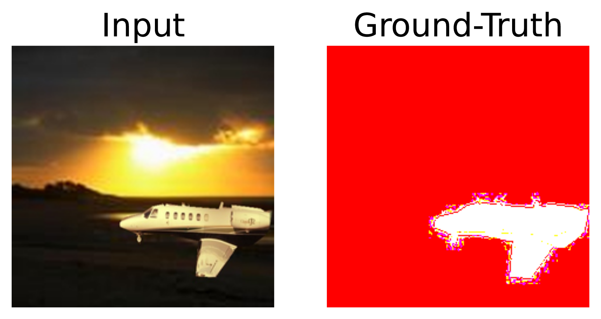

# Trend-based Faithfulness Test

This is the code for our paper which is submitted to ISSTA 2023.

We use `python3.7` to run this code with some necessary packages:

```text
captum==0.4.0
pytorch==1.9.0+cu111
torchtext==0.10.0
torchvision==0.10.0+cu111
gensim==4.1.2
numpy==1.20.3

```

This version is only used for paper review. In the future, we will open source our codes in the form of docker to make it easier for test.

## Downstream Application: Model Debugging

Model debugging is one of the ways to uncover spurious correlations learned by the model and help the users improve their models. For example, consider a classification task where all the airplanes in the dataset always appear together with the background (i.e., the blue sky). The model might then correlate the background features of the blue sky with the airplane category during training. This spurious correlation indicates that the model learns different category knowledge from what users envision, making the model vulnerable and insecure. If the users can detect the spurious correlation, they could enlarge the data space or deploy a stable deep learning module during training. In previous studies, explanation techniques are often used to diagnose spurious correlation. However, different explanation methods perform differently. For example, in the following figure, IG considers that the model focuses on both object and background while SG-IG-SQ marks the blue sky background as the important feature. We could not make sure which explanation is more conformed to the model.


We verify the effectiveness of our trend tests on guiding the user to choose an explanation method for model debugging and then examine the performance of explanation methods on detecting spurious correlations. Based on [Adebayo et al.](https://proceedings.neurips.cc/paper/2020/hash/075b051ec3d22dac7b33f788da631fd4-Abstract.html) , we construct a model with known spurious correlation and use the trend-based tests on the model to observe the faithfulness of each explanation method. Then, we analyze the model with explanation methods to see whether the explanation results focus on the spurious correlated features. Next, we could verify whether the results of the trend-based tests are consistent with the results of the debugging test. We extract the object of cats and planes from MSCOCO2017, and then replace the backgrounds with the bedroom and the coast from MiniPlaces, respectively. We synthesize eight types of data as: 


$D_{airplane-coast}$ means the object is an airplane, and the context is the coast. Each of them includes $1000$ pictures. We use the first two ($D_{airplane-coast}$ and $D_{cat-bedroom}$) to train a ResNet18 model. We split the training data into a training set and a validate set at a ratio of 8:2. The rest are used for testing. The accuracy of the model is shown in table:

|Category| Accuracy|
|:------------------------------------------:|:-----------------:|
| $D_{airplane-coast}$ and $D_{cat-bedroom}$ |      96.65\%      |
| $D_{cat-coast}$ and $D_{airplane-bedroom}$ |      64.55\%      |
|        $D_{airplane}$ and $D_{cat}$        |      58.45\%      |
|        $D_{coast}$ and $D_{bedroom}$       |      90.10\%      |

As can be seen from the table, although the model has high accuracy on $D_{airplane-coast}$ and $D_{cat-bedroom}$, the accuracy on the context ($D_{coast}$ and $D_{bedroom}$) is far more higher than the objects ($D_{airplane}$ and $D_{cat}$). This phenomenon indicates that the relative importance of the context is higher than that of the object. Therefore, we define the ground-truth important features of the model as the context features, as shown in the figure: 



Note that the model may utilize both context and object features, but when taking the top 10\% important features, it should consist mainly of the context features. We use the proposed trend tests on this model. IG and SG-IG-SQ performed similarly on EMBT and PTT. SG-IG-SQ shows a moderate correlation on EMT, while IG only shows a small correlation. Therefore, SG-IG-SQ outperformed IG in the trend-based faithfulness tests. In addition, we report the structural similarity index (SSIM) scores between the explanation results and the ground-truth mask, which is widely used for capturing the visual similarity between the two images. A high SSIM score implies a high visual similarity. SG-IG-SQ has a high SSIM score which is 0.8112, while the SSIM score of IG is 0.2453. We can also see in the above figure that SG-IG-SQ correctly marks the blue sky as important features, while IG marks both the blue sky and the airplane as important features. The results of trend-based tests are consistent with the results of SSIM scores. It means that SG-IG-SQ is most promising to help users identify the spurious correlation problem in this model. From this experiment, we could empirically confirm that the trend tests can help users to select better explanation methods, which can further help to build secure and trustworthy models.
