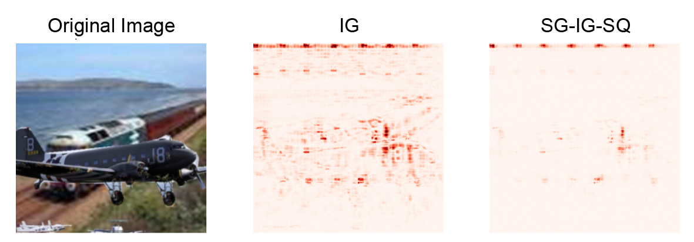
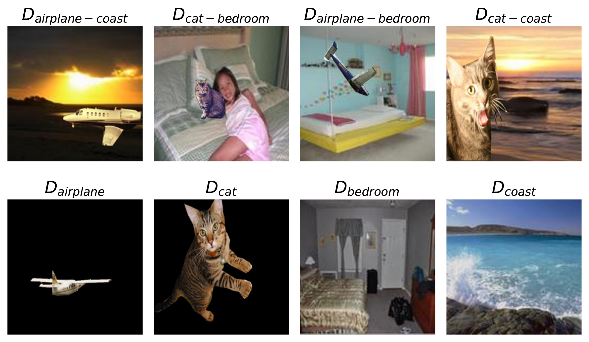
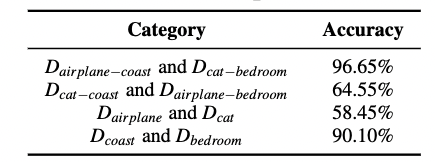
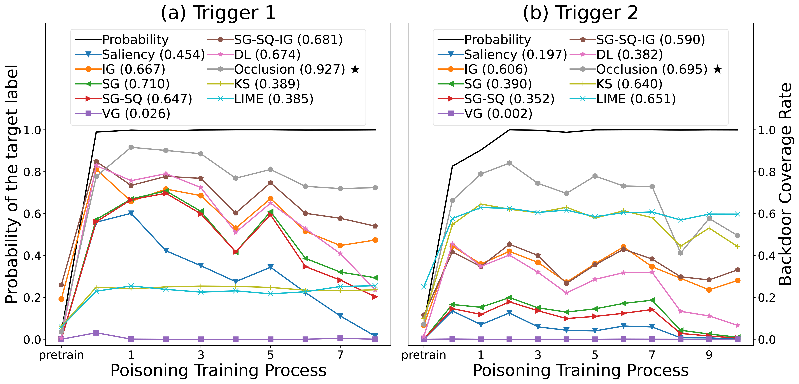
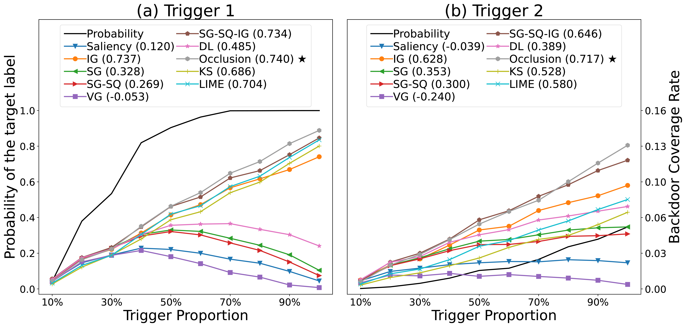
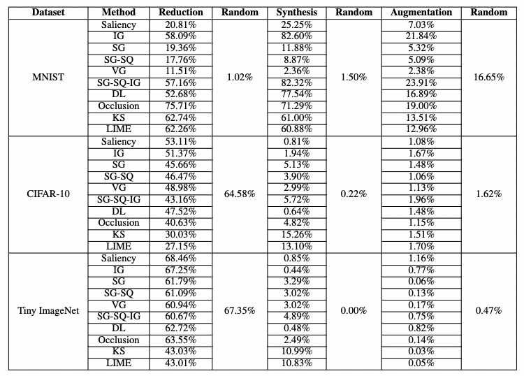
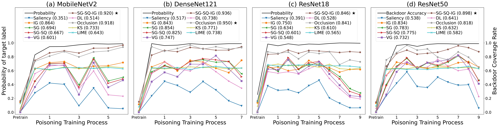
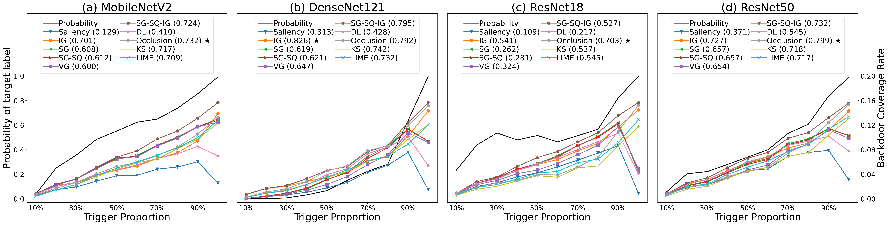
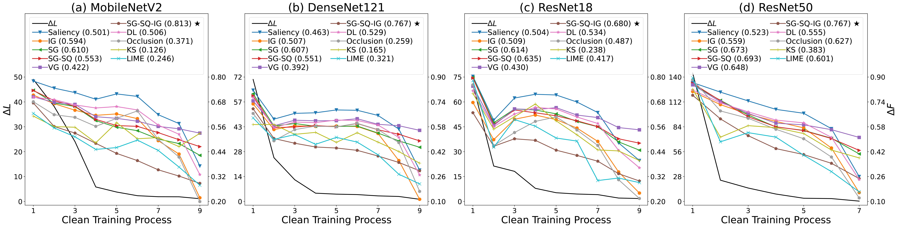
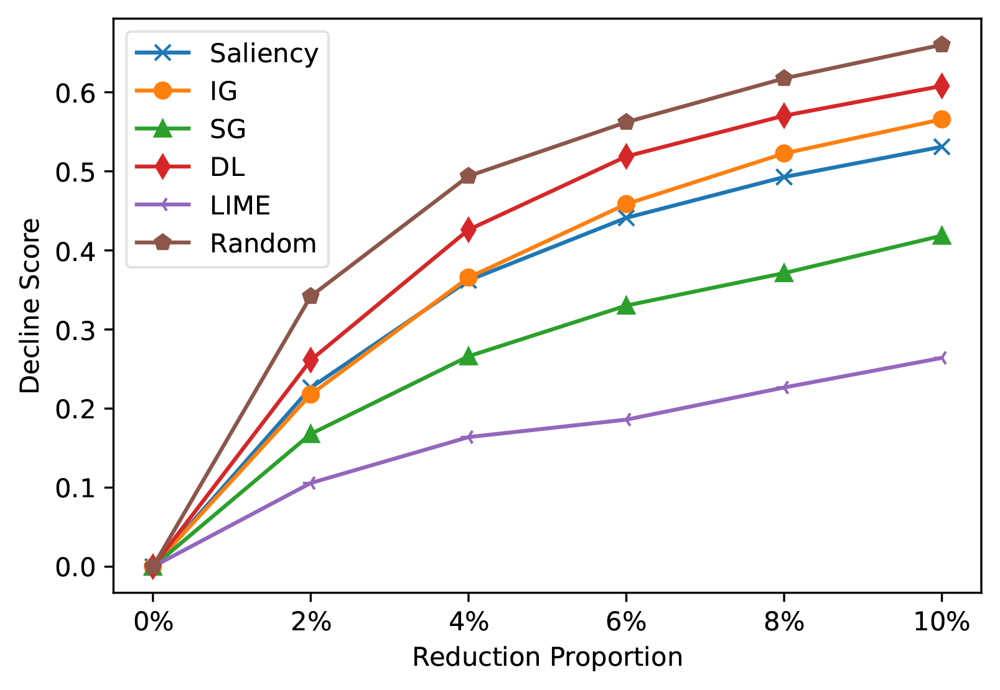

# Trend-based Faithfulness Test

This repo includes the implementation of the local explanation evaluation framework (LEEF) and extensive experiments. The LEEF integrates ten popular explanation methods and conducts faithfulness assessment on various tasks, including image classification, sentiment classification, and vulnerability detection. 

## Table of Contents

- [Trend-based Faithfulness Test](#trend-based-faithfulness-test)
  - [Table of Contents](#table-of-contents)
  - [Dependency](#dependency)
  - [Parameters](#parameters)
  - [Getting Started](#getting-started)
  - [Extensive Experiments](#extensive-experiments)
    - [Downstream application: model debugging](#downstream-application-model-debugging)
    - [Experiment on choosing different backdoor triggers](#experiment-on-choosing-different-backdoor-triggers)
    - [Detailed results of experiment on data complexity](#detailed-results-of-experiment-on-data-complexity)
    - [Detailed trends of EMBT, PTT and EMT with varying model complexity](#detailed-trends-of-embt-ptt-and-emt-with-varying-model-complexity)
    - [Different Proportion of important features](#different-proportion-of-important-features)

## Dependency

We use `python3.7` to run this code with some necessary packages:

```text
captum==0.4.0
pytorch==1.9.0+cu111
torchtext==0.10.0
torchvision==0.10.0+cu111
gensim==4.1.2
numpy==1.20.3
```

## Parameters
We use default parameters for most explanation methods, some custom parameters are as follows. 

```text
SG, SG-SQ, VG, SG-SQ-IG: stdevs=0.2
Occlusion: sliding_window_shapes=(1, 3, 3) (MNIST), (3, 3, 3) (CIFAR-10), (3, 6, 6) (Tiny-ImageNet)
LIME, KS: n_samples=500
LIME: n_segment=70(MNIST, CIFAR-10),100(Tiny-ImageNet)
```
Detailed parameters are provided in the source code.

## Getting Started

Running EMBT on MNIST: First, open the MNIST folder. Then fill out the paths to the datasets and models. Run the following files.

```text
cd mnist
python train_test_mnist.py
python train_test_backdoor_mnist.py
python exp_EMBT.py
```

## Extensive Experiments
### Downstream application: model debugging

Model debugging is one of the ways to uncover spurious correlations learned by the model and help the users improve their models. For example, consider a classification task where all the airplanes in the dataset always appear together with the background (i.e., the blue sky). The model might then correlate the background features of the blue sky with the airplane category during training. This spurious correlation indicates that the model learns different category knowledge from what users envision, making the model vulnerable and insecure. If the users can detect the spurious correlation, they could enlarge the data space or deploy a stable deep learning module during training. In previous studies, explanation techniques are often used to diagnose spurious correlation. However, different explanation methods perform differently. For example, in Figure 1, IG considers that the model focuses on both object and background while SG-IG-SQ marks the blue sky background as the important feature. We could not make sure which explanation is more conformed to the model.

<center>
    
    <br>
    <div style="color:orange; border-bottom: 1px solid #d9d9d9;
    display: inline-block;
    color: #999;
    padding: 2px;">Figure 1: Examples of different explanations.</div>
</center>

We verify the effectiveness of our trend tests on guiding the user to choose an explanation method for model debugging and then examine the performance of explanation methods on detecting spurious correlations. Based on [Adebayo et al.](https://proceedings.neurips.cc/paper/2020/hash/075b051ec3d22dac7b33f788da631fd4-Abstract.html) , we construct a model with known spurious correlation and use the trend-based tests on the model to observe the faithfulness of each explanation method. Then, we analyze the model with explanation methods to see whether the explanation results focus on the spurious correlated features. Next, we could verify whether the results of the trend-based tests are consistent with the results of the debugging test. We extract the object of cats and planes from MSCOCO2017, and then replace the backgrounds with the bedroom and the coast from MiniPlaces, respectively. We synthesize eight types of data as shown in Figure 2.

<center>
    
    <br>
    <div style="color:orange; border-bottom: 1px solid #d9d9d9;
    display: inline-block;
    color: #999;
    padding: 2px;">Figure 2: Examples of synthesized data in model debugging.</div>
</center>

$D_{airplane-coast}$ means the object is an airplane, and the context is the coast. Each of them includes $1000$ pictures. We use the first two ($D_{airplane-coast}$ and $D_{cat-bedroom}$) to train a ResNet18 model. We split the training data into a training set and a validate set at a ratio of 8:2. The rest are used for testing. The accuracy of the model is shown in Table 1.

<center>
    
    <br>
    <div style="color:orange; border-bottom: 1px solid #d9d9d9;
    display: inline-block;
    color: #999;
    padding: 2px;">Table 1: Accuracy of the model used in model debugging. The data set order corresponds to the label index.</div>
</center>

As can be seen from the table, although the model has high accuracy on $D_{airplane-coast}$ and $D_{cat-bedroom}$, the accuracy on the context ($D_{coast}$ and $D_{bedroom}$) is far more higher than the objects ($D_{airplane}$ and $D_{cat}$). This phenomenon indicates that the relative importance of the context is higher than that of the object. Therefore, we define the ground-truth important features of the model as the context features, as shown in the figure: 

<center>
    
    <br>
    <div style="color:orange; border-bottom: 1px solid #d9d9d9;
    display: inline-block;
    color: #999;
    padding: 2px;">Figure 3: Example of ground-truth important features' mask.</div>
</center>

Note that the model may utilize both context and object features, but when taking the top 10\% important features, it should consist mainly of the context features. We use the proposed trend tests on this model. IG and SG-IG-SQ performed similarly on EMBT and PTT. SG-IG-SQ shows a moderate correlation on EMT, while IG only shows a small correlation. Therefore, SG-IG-SQ outperformed IG in the trend-based faithfulness tests. In addition, we report the structural similarity index (SSIM) scores between the explanation results and the ground-truth mask, which is widely used for capturing the visual similarity between the two images. A high SSIM score implies a high visual similarity. SG-IG-SQ has a high SSIM score which is 0.8112, while the SSIM score of IG is 0.2453. We can also see in the above figure that SG-IG-SQ correctly marks the blue sky as important features, while IG marks both the blue sky and the airplane as important features. The results of trend-based tests are consistent with the results of SSIM scores. It means that SG-IG-SQ is most promising to help users identify the spurious correlation problem in this model. From this experiment, we could empirically confirm that the trend tests can help users to select better explanation methods, which can further help to build secure and trustworthy models.

### Experiment on choosing different backdoor triggers

The results of EMBT and PTT shown in Figure 4 and Figure 5, respectively. From the results, the MSE methods perform similarly to the previous experiments. LIME and KS, which are from the MAE methods, perform better on PTT when the model has more backdoor triggers compared to the previous experiments. This is because the super-pixel segmentation preprocessing of LIME and KS can aggregate backdoor triggers into one feature, making it easier to identify the important features of the triggers. The sliding window of Occlusion can also downscale the feature, and its sliding window has a similar shape to the backdoor trigger we implanted. However, this phenomenon can be corrected with EMT, which focuses on the trends of clean models.

<center>
    
    <br>
    <div style="color:orange; border-bottom: 1px solid #d9d9d9;
    display: inline-block;
    color: #999;
    padding: 2px;">Figure 4: Results of different backdoor triggers on EMBT.</div>
</center>

<center>
    
    <br>
    <div style="color:orange; border-bottom: 1px solid #d9d9d9;
    display: inline-block;
    color: #999;
    padding: 2px;">Figure 5: Results of different backdoor triggers on PTT.</div>
</center>

### Detailed results of experiment on data complexity

Table 2 shows the detailed results of the traditional tests. The conclusion is consistent with the main text. The traditional tests perform well on MNIST. We can clearly see that IG, SG-SQ-IG and Occlusion perform better. As their reduction test, augmentation test and synthesis test are significantly different from the random control group. But on the more complex CIFAR-10 and Tiny ImageNet, the reduction test, augmentation test and synthesis test are about the same or even worse than the random control group. This may not be due to the low faithfulness of the explanation methods on complex data. Rather, the OOD problem faced by traditional tests may invalidate them on complex datasets.

<center>
    
    <br>
    <div style="color:orange; border-bottom: 1px solid #d9d9d9;
    display: inline-block;
    color: #999;
    padding: 2px;">Table 2: Impact of data complexity on explanation methods assessed by traditional faithfulness tests.</div>
</center>

### Detailed trends of EMBT, PTT and EMT with varying model complexity

The detail trends of experiment on different model complexity are shown in Figure 6, Figure 7 and Figure 8. As we can see from the Figures, in each test, different models of CIFAR-10 have similar trends. For example, on EMBT, the probability of target label increases and then flattens out during training on all models. On PTT, the probability of target label gradually increases with the proportion of backdoor features. On EMT, $\Delta L$ gradually decreases during training. These trends are consistent with our previous assumptions. Other conclusions are consistent with the main text.

<center>
    
    <br>
    <div style="color:orange; border-bottom: 1px solid #d9d9d9;
    display: inline-block;
    color: #999;
    padding: 2px;">Figure 6: Results of EMBT on different model complexity.</div>
</center>

<center>
    
    <br>
    <div style="color:orange; border-bottom: 1px solid #d9d9d9;
    display: inline-block;
    color: #999;
    padding: 2px;">Figure 7: Results of PTT on different model complexity.</div>
</center>

<center>
    
    <br>
    <div style="color:orange; border-bottom: 1px solid #d9d9d9;
    display: inline-block;
    color: #999;
    padding: 2px;">Figure 8: Results of EMT on different model complexity.</div>
</center>

### Different Proportion of important features

In order to eliminate the influence on the proportion of important features retained, we take different proportions of important features for the reduction test. As shown in Figure 9, the reduction test samples made from 2\%-10\% of the important features are not as effective as the random samples.

<center>
    
    <br>
    <div style="color:orange; border-bottom: 1px solid #d9d9d9;
    display: inline-block;
    color: #999;
    padding: 2px;">Figure 9: Different proportions of important features tagged by the explanation and random selected features in the reduction test. Important features tagged by explanations perform worse than random selected features in the reduction test.</div>
</center>
